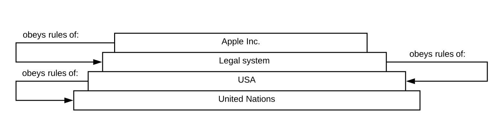
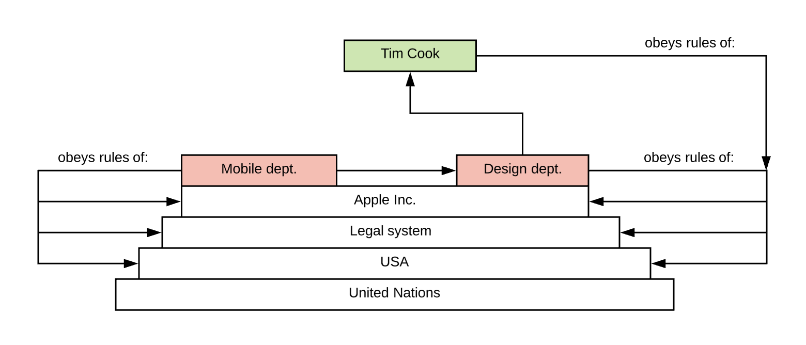

# Autonomous

## Definition of "Autonomous" \(AI industry\)



This definition is widely used in the AI/self-driving cars industry:

"The Level 5 autonomous application should make the decision based on its own intelligence and self-improve from the outcomes of the decisions that it made.

**DAO is supposed to be full autonomous, which has Level 5 automation. No human created applications reach the "autonomous" level yet.**

DApp does not mention the level of automation. All the examples it gave are the automated software since there is no autonomous software yet. All existing blockchains based DApps including Bitcoin just automate the pre-coded business logic. Vitalik mentioned the DAO as the holy grail since no one yet got there even some may have called themselves TheDAO". 

In this sense we either:

1. Should remove the "autonomous" from the DAO acronym;
2. Should change the "autonomous" to something different, like "adaptive";
3. Should treat all "DAO" projects as DOs, but not DAOs \(even "TheDAO"\);
4. Should use another acronym/term like ["AI DAO"](https://medium.com/@trentmc0/ai-daos-and-three-paths-to-get-there-cfa0a4cc37b8). 

## Definition of "Autonomous" \(by Thetta\)

[Wiki](https://en.wikipedia.org/wiki/Autonomy): "Autonomous organizations are independent or self-governing". It sounds good and is short, but definitions of "independence" and "self-governance" are very ambiguous. That's why we are going to introduce our own definition:


Synthetic definition by Thetta \(strong\): **"A system is Autononomous in the particular environment - if it does NOT obey rules of the system located on the same or higher level"**



Synthetic definition by Thetta \(weak\): **"A system is Autononomous in the particular environment - if it MOSTLY does NOT obey rules of the system located on the same or higher level"**


1. Apple Inc. obeys rules of Legal system. But Legal system does not obey rules of Apple Inc.; 
2. Apple Inc. obeys rules of Legal system **and** USA **and** United Nations.

The Mobile dept. obeys rules of Apple Inc. **and** Legal system **and** USA **and** World **and** United Nations.   
But Mobile dept. is NOT autonomous because it obeys rules of the Design dept. \(same level\) too.

The Design dept. obeys rules of Apple Inc. **and** Legal system **and** USA **and** World **and** United Nations.  
But Design dept. is NOT autonomous because it obeys rules of Tim Cook \(higher level\) too.

Tim Cook obeys rules of Apple Inc. **and** Legal system **and** USA **and** World **and** United Nations.  
But Tim Cook DOES NOT obey rules of a Design dept. and there is no one above him! That's why he is Autonomous.


Still, in reality there is no even a single system that is trully autonomous \(in this sense\). Even Tim Cook has some formal/informal input from the same level \(CEOs of Samsung, chip manufacturers, etc\) and from the level above \(Apple investors\).

That is why a "weak" version of definition above is used by us.


## Who is Autonomous and who is not?

<table>
  <thead>
    <tr>
      <th style="text-align:left"></th>
      <th style="text-align:left">Description</th>
      <th style="text-align:left">Environment</th>
      <th style="text-align:left">Autonomous to environment?</th>
    </tr>
  </thead>
  <tbody>
    <tr>
      <td style="text-align:left">Apple Inc.</td>
      <td style="text-align:left">
        
Organization registered in USA

        
(people, products)

      </td>
      <td style="text-align:left">Legal System
         (should file reports, pay taxes, etc)</td>
      <td style="text-align:left">Yes</td>
    </tr>
    <tr>
      <td style="text-align:left">ERC20 token contract deployed to the Ethereum mainnet</td>
      <td style="text-align:left">EVM bytecode deployed to Ethereum mainnet</td>
      <td style="text-align:left">Ethereum system</td>
      <td style="text-align:left">
        
Yes

        

           (most decisions are made internally)

      </td>
    </tr>
    <tr>
      <td style="text-align:left">Seller on the market</td>
      <td style="text-align:left">Human</td>
      <td style="text-align:left">Market</td>
      <td style="text-align:left">Yes</td>
    </tr>
    <tr>
      <td style="text-align:left">Russian Federation</td>
      <td style="text-align:left">Legal entity</td>
      <td style="text-align:left"></td>
      <td style="text-align:left"></td>
    </tr>
    <tr>
      <td style="text-align:left">North Korea</td>
      <td style="text-align:left">Legal entity</td>
      <td style="text-align:left"></td>
      <td style="text-align:left"></td>
    </tr>
    <tr>
      <td style="text-align:left">Ethereum</td>
      <td style="text-align:left">Blockchain system</td>
      <td style="text-align:left"></td>
      <td style="text-align:left"></td>
    </tr>
    <tr>
      <td style="text-align:left">(TODO) DO example here</td>
      <td style="text-align:left"></td>
      <td style="text-align:left"></td>
      <td style="text-align:left"></td>
    </tr>
    <tr>
      <td style="text-align:left"></td>
      <td style="text-align:left"></td>
      <td style="text-align:left"></td>
      <td style="text-align:left"></td>
    </tr>
  </tbody>
</table>## Resume. Why "Autonomous"?

Autonomous systems often have better decision making: easier, done faster and more verifiable and can better adapt to changes.

\*\*\*\*

