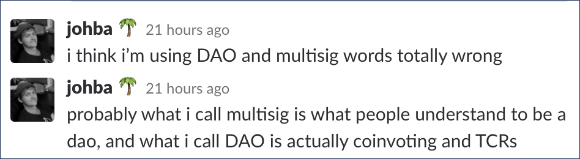

# What a DAO is

The obvious difference between a decentralized organization \(DO\) and a decentrazlied autonomous organization \(DAO\), and the one inherent in the language, is the word “autonomous”; that is, in a DO the humans are the ones making the decisions, and a DAO is something that, _in some fashion_, makes decisions for itself.  

## What DAO is and what DAO is not



In order to be a DAO, system:

* D - Should be politically AND architecturally decentralized;
* A - Should make ****some decisions automatically AND should ****not obey rules of the system located on the same or higher level;
* O - Should be comprised of multiple actors with clear governance rules, incentives and internal capital.

<table>
  <thead>
    <tr>
      <th style="text-align:left"></th>
      <th style="text-align:left">Decentralized</th>
      <th style="text-align:left">Autonomous</th>
      <th style="text-align:left">Clear governance rules and incentives</th>
      <th style="text-align:left">Internal capital</th>
      <th style="text-align:left">DAO?</th>
    </tr>
  </thead>
  <tbody>
    <tr>
      <td style="text-align:left">McDonald's</td>
      <td style="text-align:left">-</td>
      <td style="text-align:left">+</td>
      <td style="text-align:left">+</td>
      <td style="text-align:left">+</td>
      <td style="text-align:left">No</td>
    </tr>
    <tr>
      <td style="text-align:left">TheDAO</td>
      <td style="text-align:left">+</td>
      <td style="text-align:left">+</td>
      <td style="text-align:left">+</td>
      <td style="text-align:left">+</td>
      <td style="text-align:left"><b>Yes</b>
      </td>
    </tr>
    <tr>
      <td style="text-align:left">2-of-3 multisig wallet</td>
      <td style="text-align:left">+</td>
      <td style="text-align:left">+</td>
      <td style="text-align:left">+</td>
      <td style="text-align:left">+</td>
      <td style="text-align:left"><b>Yes</b>
      </td>
    </tr>
    <tr>
      <td style="text-align:left">Bitcoin, BTC
         (system)</td>
      <td style="text-align:left">+</td>
      <td style="text-align:left">+</td>
      <td style="text-align:left">+</td>
      <td style="text-align:left">+</td>
      <td style="text-align:left"><b>Yes</b>
      </td>
    </tr>
    <tr>
      <td style="text-align:left">Any Ethereum DApp or a smart contract</td>
      <td style="text-align:left">-</td>
      <td style="text-align:left">+</td>
      <td style="text-align:left">-</td>
      <td style="text-align:left">-</td>
      <td style="text-align:left">No</td>
    </tr>
    <tr>
      <td style="text-align:left">TokenCuratedRegistry (system)</td>
      <td style="text-align:left">+</td>
      <td style="text-align:left">+</td>
      <td style="text-align:left">+</td>
      <td style="text-align:left">+</td>
      <td style="text-align:left"><b>Yes</b>
      </td>
    </tr>
    <tr>
      <td style="text-align:left">
        
Bittorrent

        
(system)

      </td>
      <td style="text-align:left">+</td>
      <td style="text-align:left">+</td>
      <td style="text-align:left">-</td>
      <td style="text-align:left">-</td>
      <td style="text-align:left">No</td>
    </tr>
  </tbody>
</table>## **Resume**

DAO often consists of:

1. Assets/property: internal currency, tokens, etc;
2. Actors: curators, moderators, token holders, robots, smart contracts, etc;
3. Rules of governance/protocol: permissions, business logic, etc.

