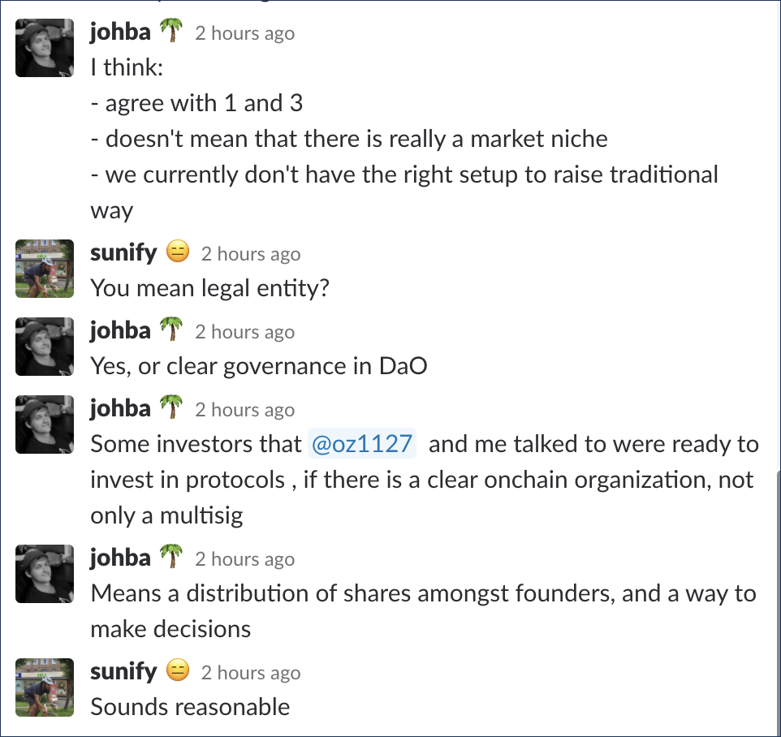

# Why and when do you need a DAO

### Use DAO:

1. If you want to **formalise** interactions between different actors **in code** instead of using written contracts:  ****_"We will pay you $100 for this task. If we don't agree, then you should go to court" -&gt; "We put $100 in the escrow, and we have a Dispute Resolution mechanism in case something goes wrong"_
2. If you want to **add incentives/penalties** to balance the process and **eliminate asymmetry**: _"If you don't attend the meeting, you should feel sorry"  -&gt; "If you don't attend the meeting, then your stake is burned"_ 
3. If you need to **effectively govern** some resource collectively;
4. If you want to **process/work with crypto** and tokens directly;
5. If you need to **add transparrency**. As a result, one can verify that protocol is applied correctly \(finances, votings, decisions, etc\);
6. If you need to **protect actors from the centralised management;**
7. If you need to **reduce possibility of censorship**.

### As a result

* DAOs lead to better decision making: easier, done faster and more verifiable; 
* DAOs can help you build entirely new business models;
* DAOs can reduce costs;
* DAOs can help you raise capital and control it.

  
  

