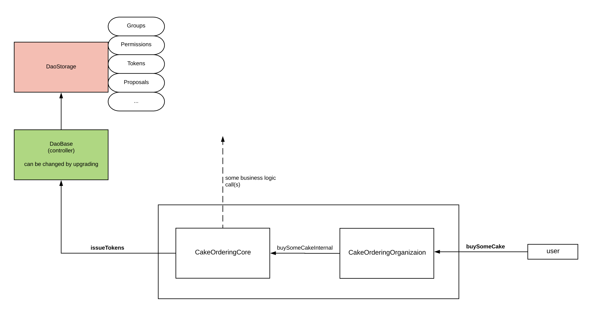

# 2 - Implementing business logic

Imagine you have an organization that order cakes from external bakery.

```text
contract Bakery {
	event cakeProduced();
	uint public cakesOrdered = 0;
	mapping (address=>bool) public isCakeProducedForAddress;

	function buySomeCake(address _cakeEater) public{
		emit cakeProduced();
		cakesOrdered = cakesOrdered + 1; // increase cakesOrdered var
		isCakeProducedForAddress[_cakeEater] = true;
	}
}

contract CakeOrderingDapp {
	function buySomeCakeInternal(Bakery _bakery) internal { 
		_bakery.buySomeCake(msg.sender);
	}
}
```

Let **buySomeCakeInternal** method calls buySomeCake from this online bakery. 

Imagine you want **CakeOrderingOrganization** to be controlled not only by yourself, but by ALL your friends. So  that is where Thetta comes in. Now lets implement **CakeOrderingOrganization**, which add **isCanDo\(\)** modifier. Only addresses that have a permission \(written in daoBase\) can call **buySomeCake\(\)**:

```text
contract CakeOrderingOrganizaion is CakeOrderingDapp, DaoClient {
	bytes32 public constant BUY_SOME_CAKE = keccak256("buySomeCake");

	constructor(Bakery _bakery, DaoBase _daoBase) public DaoClient(_daoBase){
		bakery = _bakery;
	}

	function buySomeCake() public isCanDo(BUY_SOME_CAKE) { 
		buySomeCakeInternal(bakery);
	}

	function setPermissions(DaoBase _daoBase, address _boss, address _user) public {
		// Add some address (user or contract) to Employee group
		_daoBase.addGroupMember("Managers", _boss); 

		// This will allow any address that is a member of "Managers" group 
		// to execute "issueTokens" method:
		_daoBase.allowActionByAnyMemberOfGroup(BUY_SOME_CAKE, "Managers");
		        
		// To allow specific address to execute action without any voting:
		_daoBase.allowActionByAddress(BUY_SOME_CAKE, _user);
	}
}

```


Please notice that **buySomeCakeInternal** method is marked with an _internal_ modifier and can be called only by **buySomeCake.**


### The contracts diagram will now look like this:



Ok, what have we done?

1. We left all business logic in **CakeOrderingDapp** contract;
2. We added **CakeOrderingOrganization** contract that will controlled by your friends!
3. We added new action **buySomeCake** and attached to it custom permission **BUY\_SOME\_CAKE;**

We are going to grant all actors \(i.e., users or other contracts\) permissions later \(see next chapter\).

